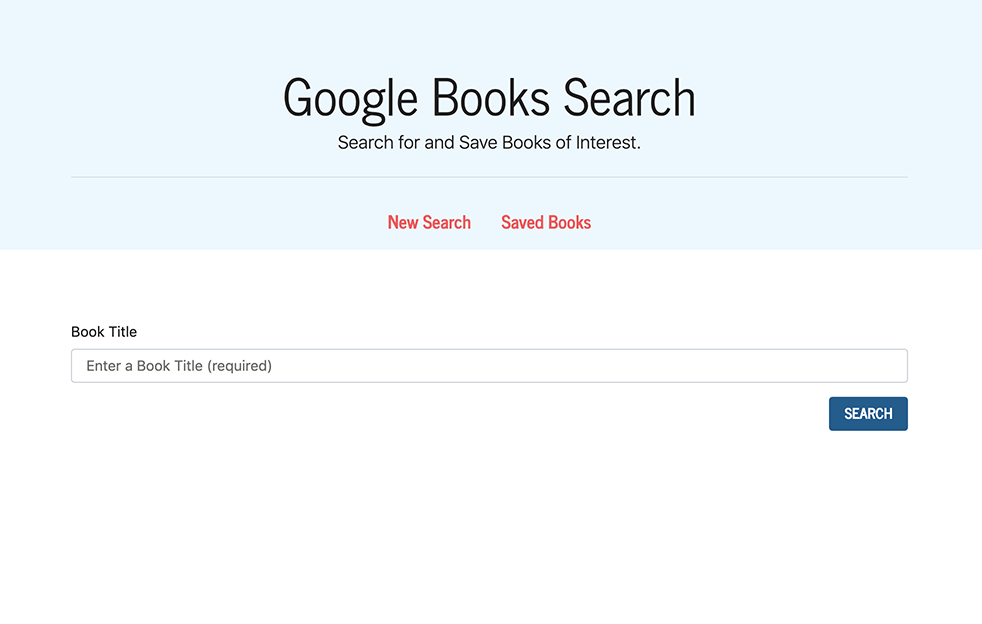
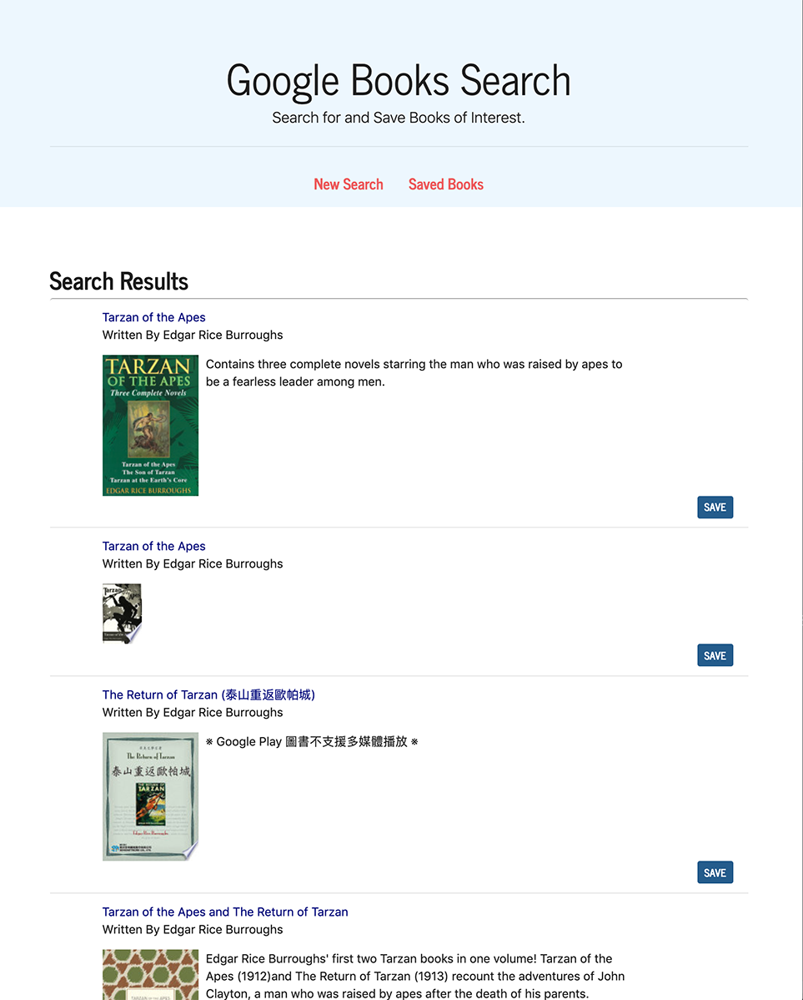
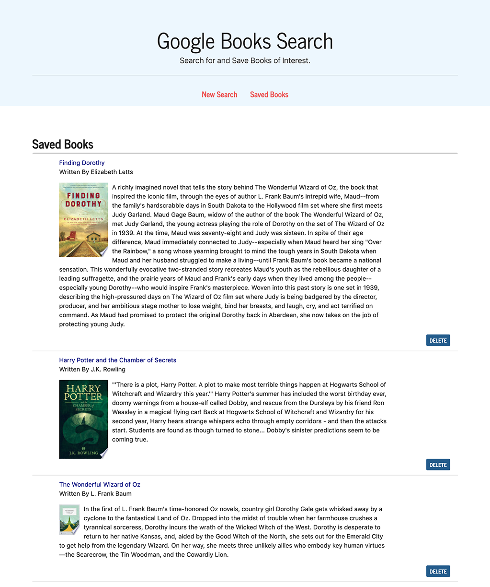

# books-search-google

### Overview
This activity required us to create a React-based Google Books Search app. The assignment required the creation of React components, work with helper/util functions, and utilize React lifecycle methods to query and display books based on user searches. Additional technologies include Node, Express and MongoDB so that users can save books to review or purchase later.

### Technical Specifications
This application includes two main pages, [SEARCH] and [SAVED BOOKS]:

  1. [SEARCH] - User can search for books via the Google Books API and render them here. User has the option to "View" a book, bringing them to the book on Google Books, or "Save" a book, saving it to the Mongo database.
    

  2. Search results display the following fields for each Book:
* `title` - Title of the book from the Google Books API
* `authors` - The books's author(s) as returned from the Google Books API
* `description` - The book's description as returned from the Google Books API
* `image` - The Book's thumbnail image as returned from the Google Books API
* `link` - The Book's information link as returned from the Google Books API
  

  3. [SAVED BOOKS] - Renders all books saved to the Mongo database. User has an option to "View" the book, bringing them to the book on Google Books, or "Delete" a book, removing it from the Mongo database.
  
4. The Express routes in this app:
* `/api/books` (get) - Returns all saved books as JSON.
* `/api/books` (post) - Saves a new book to the database.
* `/api/books/:id` (delete) - Deletes a book from the database by Mongo `_id`.
* `*` (get) - Will load the HTML page in `client/build/index.html`.

- - -

The application is deployed to Heroku at: (https://enigmatic-sands-49688.herokuapp.com/)

- - -